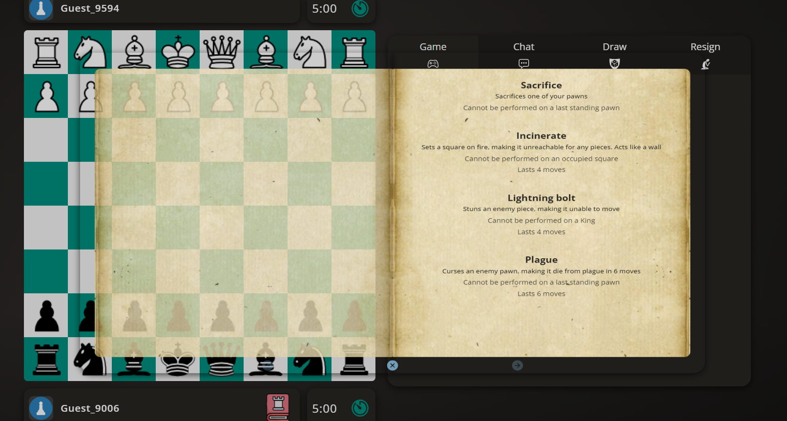
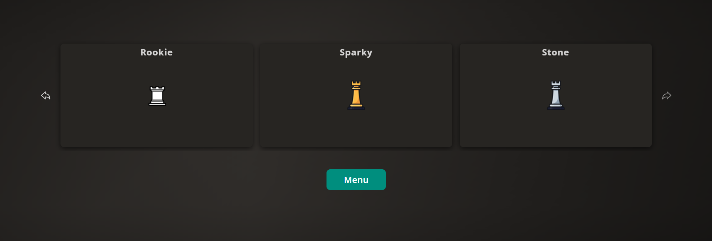

# [Ultimate chess - Multiplayer game ](https://ultimate-chess.up.railway.app/)
## Description

Web-site where you can play chess, as well as keep track of your stats, watch other chess games live, play with different skin packs and manage the web-site from admin panel.

## Idea

Attempt to turn a regular chess gameplay into an immersive battle with modern industry standard features such as customization. 

## How to play

This is app is hosted on a free hosting platform. You can check it out [here](https://ultimate-chess.up.railway.app/).

To start a game, choose a mode you want to play, copy the link and send it to your friend. As soon as your opponent connects game starts. Clock starts after the first move. If you lost connection, you have 1 minute (or 10 sec if the clock wasn't started) for reconnection, just open the same link and join the game back. Fail to do so will result in auto resign. If the clock wasn't started game will be aborted.

*It may take up to 2 minutes to load the web-page as the app is in a sleep mode, once you "wake it up" there will be no delays*

# Features

* **Play Chess** - play a traditional **Western chess** with FIDE rules;
* **Play Ultimate Chess** - try out new mode where traditional rules do not apply;
* **Watch Chess** - enjoy live action as a spectator;
* **Customize** - choose one out of several skin packs that suits you and jump into a battle;

## Ultimate mode

Ultimate mode is an addition to a regular chess gameplay. This mode lets you experience Chess from a completely different angle. Some basic movements were altered and new features were added.

* **Moves**: Pawn now can take forward and move diagonally anytime. Rook can move only 4 squares vertically and horizontally and 1 square diagonally in any direction.

* **Skills**: Perhaps the most crucial addition. Now each player has the same set of skills that they can use to gain advatage in a game. Each skill has its own constraints. Skills cannot be used before the first move or when a King is under attack. Each skill costs a move and can be used only once in a match.

This mode brings the strategy game to a new level, making more different combinations possible and some traditional patterns obsolete.

## Customization

You can choose one of several skin packs to your liking (there will be more in the future). Each skin pack can be seen by your opponent in a match. One pack has sprites both for black and white pieces, game automatically loads sprites depending on what side you’re playing. Packs can be added and edited by Administrators from the Admin panel.

This feature is available only for registered users, if you’re playing as guest you’ll be served with a default traditional sprite pack, however, you still be able to see opponent’s custom sprites if you’re playing against a registered user.

# About development

## Socket architecture
Both client and server perform necessary board computations to make sure all boards are in sync. However, validity of movements is checked only on a client side. I opted for this “hybrid” structure in order to ease a burden on a server side and at the same time avoid completely trusting a client. Server still checks win conditions and syncs the clock of both clients as well as handles reconnections, draw/rematch requests and result recordings.
## Chess engine
I decided to write my own chess engine using OOP approach in order to make additions over it later on. For example, ultimate mode functions entirely as an addition to the main game engine. Most of the things are supported such as en-passant, castling moves, draw by stalemate, draw by insufficient material, move history, FEN reader and converter. However, draw by repetition was not included as for my understanding, this should be decided by a third party (chess arbiter).
## Sounds and VFX
All sounds and VFX are royalty free, completely free to use for a non-commercial project like this one. I manually re-mastered sound effects using FL Studio to make them fit more into the game. I also created VFX “engine” to draw different effect sprites. This engine can take different sprite-sheets with different dimensions. You can configure scale, frames, frame-hold (the rate a sprite frame changes) and position offsets. Every effect is scaled automatically to the size of a cell and centered. A sprite can be scaled up or down if it appears to be too small or big.
## React structure
I didn’t follow any particular folder structure or pattern, it’s more like a mixture of different ones. I was building UI elements with scalability in mind, so most of the elements are reusable and scalable. Some UI elements were brought from my previous projects.
## Database
In order to save space in DB, matches are not recorded, therefore, cannot be analyzed afterwards. Currently, only users and sprite-packs are stores in DB, however, it would be a quite trivial task to hook up DB to game matches if a bigger DB is connected.

## Technologies used:
* React
* SocketIO
* Node Express
* TypeORM
* Postgres database
* Typescript
* Tailwind
* JWT and bcrypt for auth
* RTK query etc
* Redux

